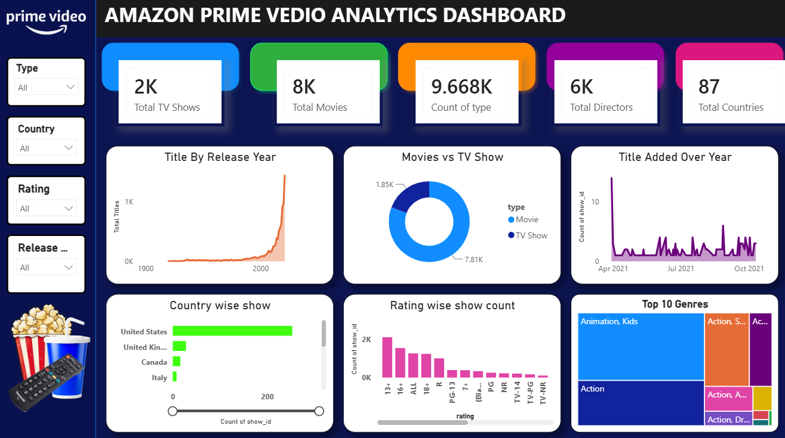

# Amazon Prime Content Analysis Dashboard | Power BI

## 📊 Project Overview

This project presents an interactive **Amazon Prime Content Analysis Dashboard** built using **Microsoft Power BI**. The dashboard analyzes Amazon Prime movies and TV shows to understand content distribution, genres, ratings, release trends, countries, and other key content insights.

## 🎯 Objectives

* Analyze the distribution of Movies and TV Shows
* Identify popular content genres
* Analyze content ratings and categories
* Understand content growth over the years
* Analyze content distribution across countries
* Compare Movies and TV Shows
* Provide interactive insights through Power BI

## 🛠️ Tools & Technologies

* **Power BI**
* **Power Query**
* **DAX**
* **Data Cleaning & Transformation**
* **Data Visualization**

## 📈 Dashboard Features

* KPI cards for key content metrics
* Movies vs TV Shows analysis
* Genre analysis
* Rating analysis
* Content release trend
* Country-wise content analysis
* Interactive slicers and filters
* Dynamic visualizations for content exploration

## 📸 Dashboard Preview

## 💡 Key Insights

The dashboard helps identify:

* Overall Movies and TV Shows distribution
* Most common content genres
* Content rating patterns
* Growth of Amazon Prime content over time
* Countries contributing the highest number of titles
* Differences between Movies and TV Shows

## 📂 Project File

The complete **Power BI `.pbix` file** is included in this repository.

## 👩‍💻 Created By

**Sakshi Patil**

Aspiring Data Analyst | Power BI | Excel | SQL | Python | Tableau
